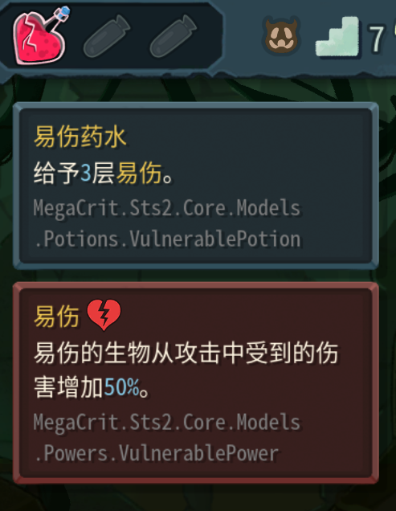

# MAILA

what Model Am I Looking At?

Show fullname of the model you are pointing at, via hover tips.  
在悬浮提示中显示你正在指向的 Model 的全名。

Screenshots（截图）:

<table>
  <tr>
    <td></td>
    <td></td>
  </tr>
  <tr>
    <td></td>
    <td></td>
  </tr>
</table>

## Downloads（下载）

[Github Releases](https://github.com/FuYnAloft/Maila/releases)

## Dependencies（依赖）

[BaseLib-Sts2](https://github.com/Alchyr/BaseLib-StS2)